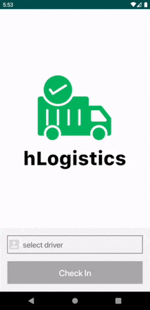
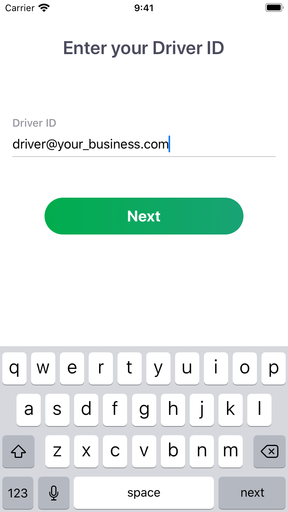
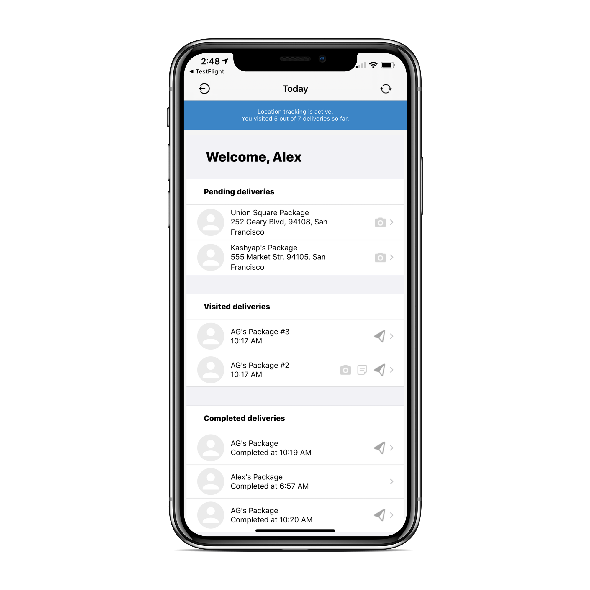
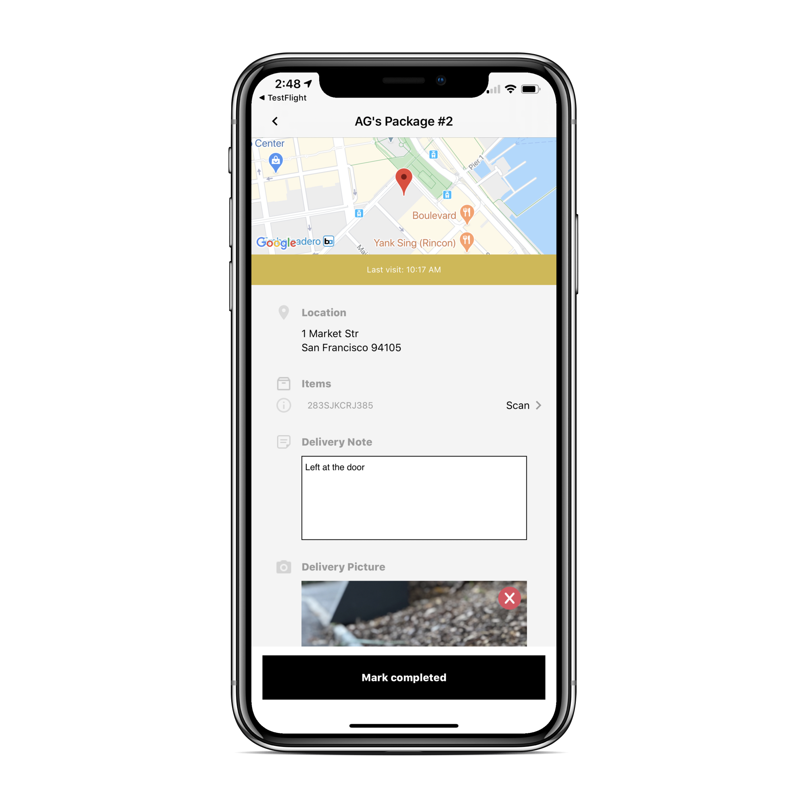
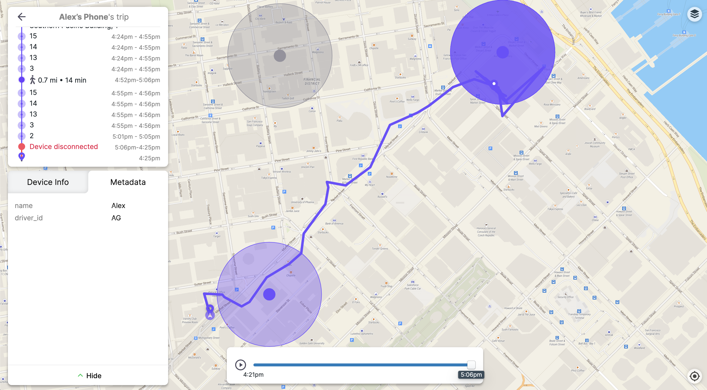
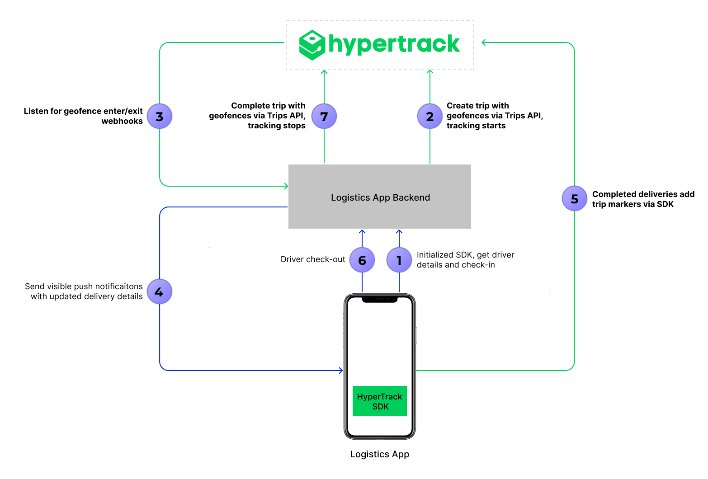

<a href="https://www.hypertrack.com/">
    
</a>

# Logistics app (iOS)

<p align="center">👉 <a href="https://github.com/hypertrack/logistics-android">Looking for the Android version?</a></p>
<p align="center"></p>

This is an open-sourced logistics application built using HyperTrack for live location tracking. This app enables logistics fleets to manage their deliveries for the day. The app assigns deliveries to the driver, tracks live location, geofences arrival at a delivery location, and automatically goes to the delivery page to add delivery notes, add proof of delivery, and mark the delivery as complete. Using this sample app will create Trips on the HyperTrack platform. Fleet managers and teams can track the day's deliveries for all drivers in real-time on HyperTrack Views.

> This app needs the [Logistics NodeJS Sample Backend](https://github.com/hypertrack/backend-nodejs-logistics) to work out of the box. The sample backend project uses the HyperTrack APIs and Webhooks, in turn managing REST API endpoints and visible push notifications for this iOS app.

## Features

| Driver Checkin                 | Overview of Deliveries          | Delivery Details               |
| ------------------------------ | ------------------------------- | ------------------------------ |
|  |  |  |

- Handle permission requests required for live location tracking
- Track driver only from checkin to checkout (HyperTrack APIs internally uses silent push notifications to manage tracking on the HyperTrack SDK)
- Track day's deliveries as Trips with geofences on HyperTrack
- Automatically update arrival, exit and current delivery to make driver productive
- Create custom markers with delivery notes and proof of delivery picture when driver completes delivery
- Update delivery status to indicate time spent at the delivery destination using geofence webhooks

This app is using HyperTrack Trips with geofences, which come with powerful views on the **HyperTrack Dashboard** to:

- Track all devices associated with your HyperTrack account on a map in real-time
- Review all delivery details, including: delivery locations, time spent and route to each delivery
- Review trip markers with proof of delivery image and delivery notes to answer support tickets



## Architecture

- This app uses the [HyperTrack SDK](https://github.com/hypertrack/quickstart-ios) to send its device location, name, metadata, and custom markers to HyperTrack's servers
- This app communicates with a backend to sync on driver and delivery updates (REST API calls and push notifications)
- The backend ([Logistics NodeJS Sample Backend](https://github.com/hypertrack/backend-nodejs-logistics)) creates and complete trips using [HyperTrack Trips APIs](https://docs.hypertrack.com/#guides-apis-usage-trips), listens to [HyperTrack Webhooks](https://docs.hypertrack.com/#guides-webhooks) and updates the delivery status with new results



<details>
<summary>Step by step process of communication:</summary>

1. **Driver checks in**
   1. The HyperTrack SDK is initialized and provides a `device_id`
   2. Push `token`, `device_id`, and further details are sent to the backend to update driver records for working push notifications
   3. After creating the day's deliveries as trips with geofences, a set of deliveries are returned to the app
2. **Trip with geofences is created**
   1. The backend has a list of pre-assigned deliveries for the driver that was checked in
   2. The backend uses the HyperTrack Trips APIs to create a new Trip with geofences set for the delivery locations
3. **Tracking is started**
   1. Upon trip creation, HyperTrack sends a silent push notification to the SDK to activate tracking
   2. The app's tracking indicator switches from red (inactive) to blue (active)
4. **Driver reaches a delivery**
   1. The backend is subscribed to HyperTrack webhooks and receives geofence arrival webhooks
   2. The delivery records are updated and a push notification is sent to the driver app
5. **Driver completes a delivery**
   1. Driver can attach delivery notes and pictures through API calls to the backend
   2. Upon completion, the HyperTrack SDK is used to create a custom trip marker with the attached details
6. **Driver checks out**
   1. The app calls the backend to checkout the current driver
   2. The backend pulls up the active HyperTrack Trip from the driver records
   3. The backend calls HyperTracks Trips APIs to complete the trip
7. **Tracking is stopped**
   1. Upon trip completion, HyperTrack sends a silent push notification to the SDK to stop tracking

</details>

## How this app uses HyperTrack APIs

The backend used for this app makes API calls to manage Trips with geofences (and device tracking).

### Trip Creation

The HyperTrack Trips API is used to create a new [trip with geofences](https://docs.hypertrack.com/#guides-track-trips-with-geofences). Each geofence represents a delivery location and includes metadata (delivery id and label). The newly created trip is stored in the driver records, so it's always known that a driver is on an active trip. This will prevent creation of new trips when a driver kills the app and checks in again before checking out.

> Note: The delivery street address is geocoded into latitude/longitude pairs before the API call to HyperTrack is made.

### Trip Completion

As soon as the driver checks out, the backend calls the HyperTrack [Complete Trip API endpoint](https://docs.hypertrack.com/#references-apis-trips-post-trips-trip_id-complete). As soon as the trip is completed, the HyperTrack API and dashboard show a trip summary, with [details like time spent and route to deliveries](https://docs.hypertrack.com/#guides-track-trips-with-geofences-get-time-spent-and-route-to).

## How this app uses HyperTrack Webhooks

The backend used for this app needs to be subscribed to HyperTrack Webhooks ([see steps here](https://docs.hypertrack.com/#guides-track-devices-with-the-api-stream-events-via-webhooks)).

### Geofence enter or exit

Whenever HyperTrack recognizes that the driver arrived at or exited the delivery geofence, [trip webhooks](https://docs.hypertrack.com/#references-webhooks-trip-payload) will be sent. The backend receives these and updates the delivery records by matching metadata set in the trip (`delivery_id`). After the records were updated, the backend pushes out visible notifications to the app. The app uses these to update the delivery status. When the notification is clicked on, the delivery detail screen is opened.

## How this app uses HyperTrack SDK

### Push Notifications

The HyperTrack account used for this app needs to be set up for push notifications ([see steps here](https://github.com/hypertrack/quickstart-ios#setup-silent-push-notifications)) to start and stop tracking during the trip.

### Tracking Status

The SDK is used to indicate the tracking status of the device.

```swift
isRunning = hyperTrack.isRunning
```

### SDK Initialization

The SDK is initialized during app startup.

```swift
let key = HyperTrack.PublishableKey(hypertrackKey)!

switch HyperTrack.makeSDK(publishableKey: key) {
  case let .success(hypertrack):
    hyperTrack = hypertrack
  case let .failure(error):
    print(error)
}
```

### Device ID

Once initialized, the SDK will provide a unique `device_id`.

```swift
return self.checkin(driverId: driverId, deviceId: self.hyperTrack.deviceID)
```

This is used to check in with a driver profile. With updates to the driver records during check-in, driver profiles can be used on different phones.

### Trip Marker

Upon delivery completion, the SDK is used to create a new trip marker.

```swift
/// Adds trip marker with Hypertrack in addition to marking delivery as complete
var dict = [String: Any]()
  dict["deliveryId"] = delivery.deliveryId
  dict["deliveryStatus"] = "completed"
  dict["deliveryNote"] = delivery.deliveryNote?.emptyNil
  dict["deliveryPicture"] = delivery.deliveryPicture?.emptyNil

if let metadata = HyperTrack.Metadata(dictionary: dict) {
  self.hyperTrack.addTripMarker(metadata)
}
```

## How to begin

### 1. Get your keys

- [Signup](https://dashboard.hypertrack.com/signup) to get your [HyperTrack Publishable Key](https://dashboard.hypertrack.com/setup)

### 2. Set up logistics app

```shell
# Clone this repository
$ git clone https://github.com/hypertrack/logistics-ios.git

# cd into the project directory
$ cd logistics-ios

# install dependencies
$ pod install
```

You can now open `Logistics.xcworkspace` in Xcode.

### 3. Create Google Maps API Key

The app uses Google Maps SDK to display package locations. Follow [instructions](https://developers.google.com/maps/documentation/embed/get-api-key) to get an API Key.

### 4. Set up backend

A backend is required to manage the drivers/deliveries and to leverage HyperTrack APIs and Webhooks. You can use the [Logistics NodeJS Sample Backend Integration](https://github.com/hypertrack/backend-nodejs-logistics) project to spin up a backend that works out of the box. Please follow the [setup steps](https://github.com/hypertrack/backend-nodejs-logistics#installation-and-setup) to spin up the backend and configure webhooks appropriately.

### 5. Configure and run the app

- Add your HyperTrack publishable key, Google Maps Key, and backend URL in [`Logistics/Constants/AppConstants.swift`](https://github.com/hypertrack/logistics-ios-hidden/blob/master/Logistics/Constants/AppConstants.swift):

```swift
let logisticsApiURL = URL(string: "https://<YOUR_SERVER_URL>")! // swiftlint:disable:this force_unwrapping
let hypertrackKey = "<YOUR_PUBLISHABLE_KEY>"
let googleMapsApiKey = "<YOUR_GOOGLE_MAPS_KEY>"
```

You can now run the app on-device. Being able to run the app and checkin with a driver means that the whole setup works.

## Documentation

For detailed documentation of the APIs, customizations and what all you can build using HyperTrack, please visit the official [docs](https://docs.hypertrack.com).

## Contribute

Feel free to clone, use, and contribute back via [pull requests](https://help.github.com/articles/about-pull-requests/). We'd love to see your pull requests - send them in! Please use the [issues tracker](https://github.com/hypertrack/logistics-ios/issues) to raise bug reports and feature requests.

We are excited to see what live location feature you build in your app using this project. Do ping us at help@hypertrack.com once you build one, and we would love to feature your app on our blog!

## Support

Join our [Slack community](https://join.slack.com/t/hypertracksupport/shared_invite/enQtNDA0MDYxMzY1MDMxLTdmNDQ1ZDA1MTQxOTU2NTgwZTNiMzUyZDk0OThlMmJkNmE0ZGI2NGY2ZGRhYjY0Yzc0NTJlZWY2ZmE5ZTA2NjI) for instant responses. You can also email us at help@hypertrack.com.

## Credits

This project uses the following open-source packages:

- [SwiftLint](https://github.com/realm/SwiftLint): Enforces Swift coding style.
- [SwiftGen](https://github.com/SwiftGen/SwiftGen): Generates Swift code from assets.
- [Kingfisher](https://github.com/onevcat/Kingfisher/): To load images from URL.
- [Google Maps](https://developers.google.com/maps/documentation/ios-sdk/intro): Used to display map of delivery location.
