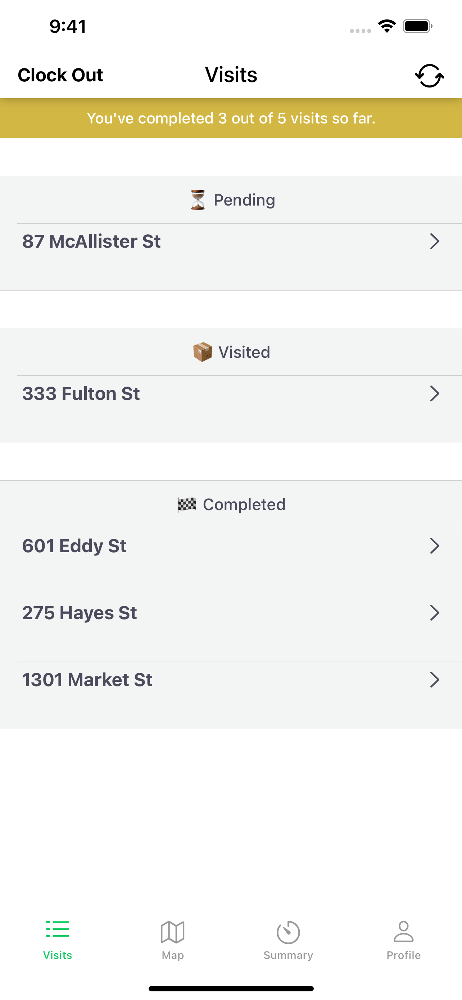
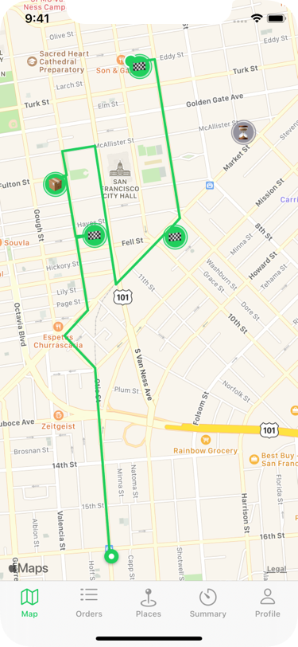
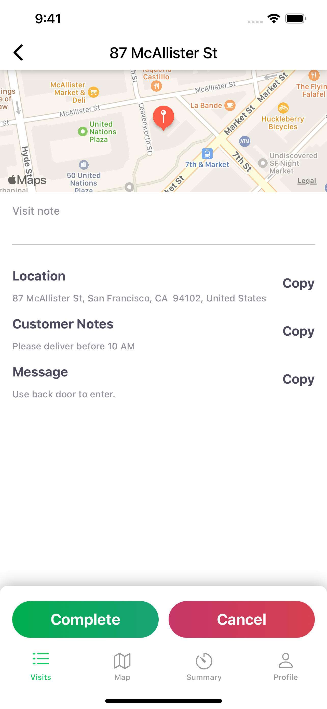

<a href="https://www.hypertrack.com/">
    
</a>

# Visits app (iOS)

<p align="center">👉 <a href="https://github.com/hypertrack/logistics-android">Looking for the Android version?</a></p>

This is an open-sourced logistics application (also available in [AppStore](https://apps.apple.com/us/app/hypertrack-logistics/id1511752692)) built using HyperTrack for live location tracking. This app enables logistics fleets to manage their deliveries for the day. The app assigns deliveries to the driver, tracks live location, geofences arrival at a delivery location, and allows to add delivery notes and mark the delivery as complete. Fleet managers and teams can track the day's deliveries for all drivers in real-time on HyperTrack Views.

## Features

| Visits Overview                | Visits Timeline                 | Visit Details                  |
| ------------------------------ | ------------------------------- | ------------------------------ |
|  |  |  |

- Handle permission requests required for live location tracking
- Track day's deliveries as geofences on HyperTrack
- Automatically update arrival, exit and current delivery to make driver productive
- Create custom markers with delivery notes and for delivery completion
- Update delivery status to indicate time spent at the delivery destination using geofence webhooks

This app is using HyperTrack geofences, which come with powerful views on the **HyperTrack Dashboard** to:

- Track all devices associated with your HyperTrack account on a map in real-time
- Review all delivery details, including: delivery locations, time spent and route to each delivery
- Review custom markers with delivery notes and delivery completion to answer support tickets


## How to integrate the app with your backend

You can roll out the apps to drivers first and integrate backend later or do it the other way around.

### Associate app installs with drivers

Every time a driver installs the app and enters his `driver_id` a new `device_id` is created. Query `GET /devices` API to obtain a list of all app installs made by your drivers:
```bash
curl "https://v3.api.hypertrack.com/devices" \
     -u '{AccountId}:{SecretKey}'
```
* `AccountId` and `SecretKey` are API keys and can be obtained in the dashboard's [Setup page](https://dashboard.hypertrack.com/setup)

You will get a response similar to the following (check out all possible fields in our [API Reference](https://hypertrack.com/docs/references/#references-apis-devices-get-device-list):
```jsonc
[
    {
        "device_id": "DEADBEEF-DEAD-BEEF-DEAD-BEEFDEADBEEF",
        "registered_at": "2019-07-26T09:00:00Z",
        "metadata": {
            "driver_id": "driver@your_business.com"
        }
        ...
    }
]
```

Use the `driver_id` field to match a driver to a record in your system. Associate and store the `device_id` in your datastore. This identifier is important and it is used throughout HyperTrack APIs to identify devices. See [this guide](https://hypertrack.com/docs/guides/setup-and-manage-devices) for more about device management.

Run this query every time you expect drivers to install the Visits app. We recommend to make a query at the start of each working day before delivery assignment. This way your system will always be in sync with the app.

Apps can be reinstalled or installed on multiple phones, which can result in multiple devices with the same metadata but different `device_id`s. If you expect your drivers to only use one mobile phone with the app installed, update your user record with `device_id` having the latest `registered_at` value and delete the no longer needed `device_id` from HyperTrack. The deleted `device_id` won't be able to accidentally track and won't be billed for your account going forward, but the tracking data will be saved.

```bash
curl -X "DELETE" "https://v3.api.hypertrack.com/devices/{device_id}" \
     -u '{AccountId}:{SecretKey}'
```

### Assign deliveries to drivers

Every time you assign a delivery to a driver in your system create a geofence at customer's location.

```bash
curl -X "POST" "https://v3.api.hypertrack.com/geofences" \
     -u '{AccountId}:{SecretKey}' \
     -d $'{
    "device_ids": [
        "DEADBEEF-DEAD-BEEF-DEAD-BEEFDEADBEEF"
    ],
    "geofences": [
        {
            "geometry": {
                "type": "Point",
                "coordinates": [ 122.395223, 37.7947633]
            },
            "radius": 100,
            "metadata": {
                "Customer Notes": "Please deliver before 10 AM",
                "Message": "Use back door to enter."
            }
        }
    ]
}'
```

* `device_id` is the HyperTrack's id associated with your driver
* `geofences` you can assign multiple deliveries for the same driver at once by having multiple objects in this array
* `geometry`  is a geometry of a geofence with circular represented by "Point" value and polygon as "Polygon". Both types are represented in [GeoJSON format](https://hypertrack.com/docs/references#references-geojson) where coordinates have longitude as a 0'th element and latitude as 1'st
* `radius` is the radius for a circular geofence type. We suggest radius at least 100 meters to account for a driver meeting a customer outside of the building
* `metadata`  You can add any number of fields in the form `"string key": "string value"`  and the app will display them in the UI. You can also include non-string values, the app will ignore them, but you can use them later when querying the data or receiving events from webhooks.

Response:
```jsonc
[
    {
        "geofence_id": "deadbeef-dead-beef-dead-beefdeadbeef",
        "created_at": "2020-05-26T09:00:00.000Z",
        ...
    }
]
```

* `geofence_id` the ID of a newly created geofence. Associate it with your delivery and store it in your datastore
* `created_at` timestamp when geofence was created. Visits app uses this timestamp to order deliveries from oldest to newest

The geofence will be represented as a delivery on a driver's app. The delivery address will be reverse geocoded automatically by the app based on location. The street name and house number will be used as a name for the delivery.

### Track customer visits

HyperTrack uses webhooks for realtime events delivery. Follow the [setup guide](https://hypertrack.com/docs/guides/track-devices-with-api#stream-events-via-webhooks) to set them up.

Every time your driver enters or exits the customer's geofence a webhook event will be generated:
```jsonc
[
    {
        "type": "geofence",
        "device_id": "DEADBEEF-DEAD-BEEF-DEAD-BEEFDEADBEEF",
        "data": {
            "geofence_id": "deadbeef-dead-beef-dead-beefdeadbeef",
            "value": "exit",
            "arrival": {
                "location": {
                    "type": "Point",
                    "coordinates": [ 122.395235, 37.7947645]
                },
                "recorded_at": "2020-05-26T10:00:00.000Z"
            },
            "exit": {
                "location": {
                    "type": "Point",
                    "coordinates": [ 122.395265, 37.7947671]
                },
                "recorded_at": "2020-05-26T10:05:00.000Z"
            }
        },
        ...
    }
]
```

* `type` type of webhook data, here it's a `geofence` type webhook, but there are webhooks for many [other useful events](https://hypertrack.com/docs/references#references-webhooks)
* `device_id` of a device associated with driver that generated the event
* `geofence_id` the id of the geofence associated with delivery
* `value` can be either `entry` or `exit`. In case of `entry`, only `arrival` field will be present, and in case of `exit` both `arrival` and `exit` fields will be present
* `arrival` the driver's location where he entered the customer's geofence
* `exit` the driver's location where he exited the customer's geofence

### Track driver's performance

For every delivery, driver can send multiple delivery notes and mark every delivery as completed once. These actions will be sent as webhooks in real time:
```jsonc
[
    {
        "type:": "custom_marker",
        "device_id": "DEADBEEF-DEAD-BEEF-DEAD-BEEFDEADBEEF",
        "recorded_at": "2020-05-26T10:03:00.000Z",
        "location": {
            "type": "Point",
            "coordinates": [ 122.395265, 37.7947671]
        },
        "data": {
            "metadata": {
                "geofence_id" : "deadbeef-dead-beef-dead-beefdeadbeef",
                "delivery_note" : "Door code changed to 123"
            }
            "route_to":{
                "distance": 500,
                "duration": 120,
                "start_location": {
                    "geometry": {
                        "type": "Point"
                        "coordinates": [ 122.395265, 37.7947671],
                    },
                    "recorded_at": "2020-05-26T10:02:00.000Z"
                }
            }
        }
    },
    {
        "data": {
            "metadata": {
                "geofence_id" : "deadbeef-dead-beef-dead-beefdeadbeef",
                "completed" : true
            }
            ...
        }
        ...
    }
]
```

* `type` of webhook data. Visits app sends delivery notes and delivery completions as [`custom_marker` event](https://hypertrack.com/docs/references#references-webhooks-custom-marker-payload)
* `device_id` of a device that generated the event, corresponds to driver
* `recorded_at` a timestamp when driver made the action to either complete or send delivery notes
* `location` of the driver when he performed the action
* `metadata` will always have a `geofence_id` associated with the delivery the driver was interacting with and either `delivery_note` of type String the driver entered in a text field or `"completed": true` if driver tapped the "complete" button
* `route_to` contains a location of previous `custom_marker` with `distance` and `duration` between them. Use this data for driver's productivity analysis based on when and where driver completed the delivery

### Remove deliveries

Once delivery is completed or the next morning when new deliveries are dispatched, delete geofences associated with them using DELETE API:

```bash
curl -X "DELETE" "https://v3.api.hypertrack.com/geofences/{geofence_id}" \
     -u '{AccountId}:{SecretKey}'
```


## Documentation

For detailed documentation of the APIs, customizations and what all you can build using HyperTrack, please visit the official [docs](https://docs.hypertrack.com).

## Contribute

Feel free to clone, use, and contribute back via [pull requests](https://help.github.com/articles/about-pull-requests/). We'd love to see your pull requests - send them in! Please use the [issues tracker](https://github.com/hypertrack/logistics-ios/issues) to raise bug reports and feature requests.

We are excited to see what live location feature you build in your app using this project. Do ping us at help@hypertrack.com once you build one, and we would love to feature your app on our blog!

## Support

Join our [Slack community](https://join.slack.com/t/hypertracksupport/shared_invite/enQtNDA0MDYxMzY1MDMxLTdmNDQ1ZDA1MTQxOTU2NTgwZTNiMzUyZDk0OThlMmJkNmE0ZGI2NGY2ZGRhYjY0Yzc0NTJlZWY2ZmE5ZTA2NjI) for instant responses. You can also email us at help@hypertrack.com.
